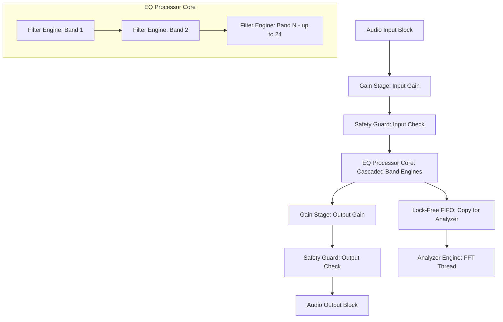

# Arquitetura de DSP: AUREQ

Este documento descreve o projeto técnico e a arquitetura de processamento digital de sinais (DSP) do equalizador **AUREQ**, parte da **ASTRA Audio Suite**. Ele serve como base conceitual para o desenvolvimento de áudio, garantindo qualidade profissional de processamento, estabilidade numérica e isolamento rigoroso entre a thread de áudio e a interface gráfica (UI).

---

## 1. Visão Geral da Pipeline de Processamento

O processamento do sinal no AUREQ é estruturado de forma linear e modular, operando de forma estéreo e independente em cada canal (Left/Right) sample-by-sample dentro do bloco fornecido pela DAW.

---

## 2. Componentes da Arquitetura DSP

### A. Motor de Bandas Modular (Cascaded Filter Engines)
*   O motor DSP baseia-se em uma estrutura em cascata de filtros biquad de segunda ordem (IIR).
*   Cada banda é encapsulada em seu próprio módulo de processamento (`FilterEngine`), contendo os estados históricos de atraso das amostras (`w1`, `w2` na forma transposta II ou similar) independentes para cada canal de áudio.
*   **Vantagem da cascata**: Facilidade de adicionar/remover bandas dinamicamente e facilidade de calcular de forma isolada a resposta individual de magnitude e fase.

### B. Estrutura de Parâmetros de Banda (`EQBandParameters`)
Cada banda do equalizador é controlada por uma estrutura de dados de controle atômica contendo:
*   `active` (bool): Estado de bypass ou ativação da banda.
*   `type` (enum): Tipo de filtro (Bell, Low Cut, High Cut, Low Shelf, High Shelf, Notch, Band Pass).
*   `frequency` (float): Frequência em Hertz (20.0 Hz a 20000.0 Hz).
*   `gain` (float): Ganho em dB (-12.0 dB a +12.0 dB).
*   `q` (float): Fator de qualidade (0.1 a 18.0).
*   `dynamicActive` (bool): Habilita equalização dinâmica.
*   `dynamicThreshold` (float): Threshold dinâmico em dB (0.0 a -60.0 dB).
*   `dynamicRatio` (float): Razão de compressão/expansão (1:1 a 10:1).
*   `dynamicAttack` (float): Tempo de ataque (0.5 ms a 100 ms).
*   `dynamicRelease` (float): Tempo de decaimento (10 ms a 1000 ms).

### C. Suavização de Parâmetros (`ParameterSmoother`)
*   Para evitar estalos acústicos (*zipper noise*) decorrentes de alterações bruscas de parâmetros pelo usuário ou por automação, o processador calcula coeficientes de rampa.
*   Os parâmetros de controle (Frequência, Ganho, Q) são interpolados através de filtros passa-baixa de primeira ordem (one-pole filter) rodando na frequência de amostragem (`sampleRate`), garantindo curvas contínuas de alteração de coeficientes a cada sample.

### D. Segurança e Proteção Numérica (`SafetyGuard`)
*   Filtros recursivos IIR são propensos a instabilidades se os parâmetros entrarem em estados críticos (ex: Q muito alto perto de Nyquist ou divisão por zero).
*   O `SafetyGuard` executa verificações de segurança:
    *   **Anti-denormal**: Adição constante de dither analógico de baixíssimo nível (`1e-15` ou similar) nos estados internos dos filtros IIR para evitar que a CPU gaste ciclos calculando números infinitamente próximos de zero.
    *   **Mute de Proteção**: Varredura na saída de cada bloco para detectar `isnan()` ou `isinf()`. Se detectado, limpa imediatamente os registradores de atraso (`w1 = w2 = 0`) da banda problemática para evitar "blow up" de áudio e silencia o buffer temporariamente para proteger o monitoramento do usuário.

### E. Analisador FFT em Tempo Real (`AnalyzerEngine`)
*   O processador de áudio não faz cálculos gráficos e de FFT diretamente na thread de áudio de alta prioridade.
*   **Pipeline do Analisador**:
    1.  No método `processBlock`, uma cópia dos samples de saída (pós-EQ) é injetada em um buffer circular assíncrono livre de travas (`Lock-Free FIFO`).
    2.  A thread da interface gráfica (ou uma thread secundária de baixa prioridade de análise) lê os dados deste FIFO.
    3.  A thread de análise junta blocos suficientes (ex: 2048 ou 4096 amostras), aplica uma função de janelamento (Hann/Hamming) para evitar distorção de bordas (*spectral leakage*), calcula a FFT rápida e converte os bins complexos em magnitude logarítmica (dB).
    4.  A curva espectral suavizada é disponibilizada de forma segura para o redesenho na UI.

### F. Independência de Taxa de Amostragem (`Sample Rate Independence`)
*   Durante a inicialização do plugin no método `prepareToPlay(sampleRate, samplesPerBlock)` do JUCE, a taxa de amostragem corrente é propagada para todas as bandas.
*   Fórmulas de envelopes temporais (Attack, Release) e coeficientes de frequência dos filtros IIR são recalculados com base no `sampleRate` real da DAW, assegurando comportamento idêntico a 44.1 kHz, 48 kHz, 96 kHz ou 192 kHz.

---

## 3. Proposta Conceitual de Classes

Sem implementar código C++, a estrutura do motor DSP do AUREQ é planejada através das seguintes entidades conceituais:

### 1. `EQBand`
*   **Responsabilidade**: Gerencia o estado de processamento de uma única banda de EQ.
*   **Métodos Principais**:
    *   `prepare (double sampleRate)`: Configura a banda para a frequência de amostragem atual.
    *   `updateCoefficients (const EQBandParameters& params)`: Calcula os coeficientes $a_0, a_1, a_2, b_0, b_1, b_2$ do biquad com base nos parâmetros suavizados.
    *   `processSample (int channel, float inputSample)`: Processa uma amostra individual retornando a saída filtrada.

### 2. `EQBandParameters`
*   **Responsabilidade**: Estrutura simples de transferência de dados que contém os parâmetros de controle de uma banda (Frequência, Ganho, Q, Tipo, Bypass, Dinâmica).

### 3. `FilterEngine`
*   **Responsabilidade**: A classe utilitária matemática que calcula as equações biquad de segunda ordem, implementando a topologia direta de atraso ou forma transposta II (Direct Form II Transposed).

### 4. `EQProcessorCore`
*   **Responsabilidade**: Gerencia a coleção de instâncias de `EQBand` (até 24) e orquestra o encadeamento em cascata.
*   **Métodos Principais**:
    *   `prepareToPlay (double sampleRate, int maxBlockSize)`: Inicializa todas as bandas e aloca memória antecipadamente.
    *   `processAudioBlock (juce::AudioBuffer<float>& buffer)`: Loop principal que percorre os samples de áudio pelos canais, aplicando as bandas sequencialmente.

### 5. `ParameterSmoother`
*   **Responsabilidade**: Aplica interpolação de primeira ordem a um parâmetro de controle para evitar Zipper Noise.
*   **Métodos Principais**:
    *   `setTargetValue (float target)`: Define o valor final do parâmetro.
    *   `getNextValue ()`: Avança a interpolação em um passo de amostra e retorna o valor corrente.

### 6. `SafetyGuard`
*   **Responsabilidade**: Monitoramento sanitário e sanitização de canais e floats, agindo na entrada e saída de áudio para evitar NaNs e subnormais.

### 7. `GainStage`
*   **Responsabilidade**: Aplica ganho estático de entrada ou saída com compensação suave e controle de saturação básica se necessário.

### 8. `AnalyzerEngine`
*   **Responsabilidade**: Gerencia o processamento FFT assíncrono para geração gráfica do espectro da interface.
*   **Componentes Internos**:
    *   `Lock-Free FIFO`: Fila circular segura para transferir áudio da thread de áudio para a thread de análise de baixa prioridade.
    *   `FFTProcessor`: Executa a transformada rápida de Fourier e operações de janelamento.

### 9. `DynamicEQEngine` (Roadmap Versão 1.0)
*   **Responsabilidade**: Calcula o envelope de áudio de entrada para uma banda, determinando o ganho dinâmico adaptativo baseado em Threshold e Ratio de compressão/expansão.

### 10. `SpectrumProcessor` (Roadmap Versão Avançada)
*   **Responsabilidade**: Motor de alta performance para processamento espectral contínuo de bins de FFT (utilizado no Spectral Dynamic EQ e EQ Match).

---

## 4. Isolamento Estrito de Thread (Audio/UI Thread Isolation)

Para evitar dropouts de áudio (estalos no som causados por atraso na thread de áudio prioritária da DAW), o processamento obedece a regras de alocação estritas:
1.  **Zero Alocação**: Nenhuma alocação de memória dinâmica (`new`, `malloc`, `std::vector::resize`) ocorre dentro de `processBlock`. Toda a memória necessária (buffers de atraso das 24 bandas e blocos do analisador) é pré-alocada durante a chamada de inicialização `prepareToPlay`.
2.  **Zero Locks**: A thread de áudio nunca usa travas de Mutex (`std::mutex`, `juce::CriticalSection`) para se comunicar com a interface gráfica. Toda a comunicação ocorre via dados atômicos leves (`std::atomic`) ou filas de dados de tamanho fixo livre de travas (`Lock-Free FIFOs`).
3.  **Desacoplamento Gráfico**: A UI desenha a resposta de frequência usando métodos analíticos matemáticos rápidos a partir dos coeficientes teóricos dos filtros, sem depender de varreduras de áudio em tempo real ou consultas bloqueantes ao motor de sinal.
